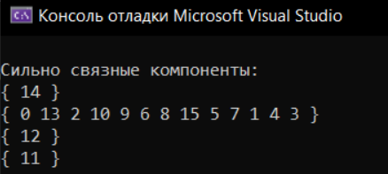

# Поиск Сильно Связных Компонент (ССК) в графе

## Основная Информация
На изображении представлен вывод программы, выполняющей поиск сильно связных компонент (ССК) в графе.

### Что программа вывела:
1. Программа нашла 4 сильно связные компоненты, представленные в виде списков вершин:
   - **{14}:** Содержит только вершину 14.
   - **{0, 13, 2, 10, 9, 6, 8, 15, 5, 7, 1, 4, 3}:** Крупнейшая компонента, содержащая перечисленные вершины.
   - **{12}:** Содержит только вершину 12.
   - **{11}:** Содержит только вершину 11.

### Интерпретация
- **Сильно связная компонента (ССК)** — это подграф, в котором каждая вершина достижима из любой другой вершины в этой компоненте.
- Программа сначала выполняет прямой проход DFS (сохраняя порядок завершения), затем обратный проход по транспонированному графу, выделяя ССК.

### Пример расшифровки:
- Компонента **{14}:**
  - Вершина 14 образует ССК сама по себе. Это значит, что в графе нет других вершин, из которых можно попасть в 14 или из которых можно достичь другие вершины.
- Крупнейшая компонента **{0, 13, 2, ...}:**
  - Все эти вершины образуют один сильно связный подграф. Это значит, что для любой пары вершин в этой группе можно построить пути в обоих направлениях.
- Компоненты **{12}** и **{11}:**
  - Эти вершины также не соединены с другими частями графа в обе стороны.

### Возможные причины такого вывода:
- В графе много изолированных подграфов или вершины соединены односторонними рёбрами, что делает невозможным достижение других групп вершин.

